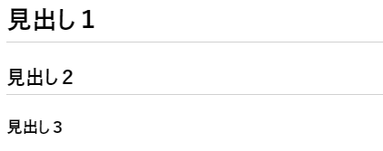
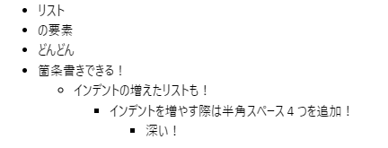
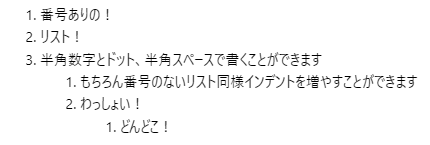

マークダウンの書き方を忘れてしまうことが多く、いつも調べている……。

ということでよく使うものをメモをしていきます。

スクリーンショットは Visual Studio Code での表示です。  
マークダウンのビューワーによって見え方は異なります。

## 見出し

### 見出し１

```text
# 見出し１
```

### 見出し２

```text
## 見出し２
```

### 見出し３

```text
### 見出し３
```

### 見出し４

```text
#### 見出し４
```



`#`を増やしていくと、見出しがどんどん小さくなっていきます。

`#`の後と見出しの文字の間には半角スペースが入ります！
{.text-block .text-block--warning}

## リスト

```md
-   リスト
-   の要素
-   どんどん
-   箇条書きできる！
    -   インデントの増えたリストも！
        -   インデントを増やす際は半角スペース４つを追加！
            -   深い！
```



リストを深くしていく場合には半角スペースを４つ追加していきます。

## 番号付きリスト

```md
1. 番号ありの！
1. リスト！
1. 半角数字とドット、半角スペースで書くことができます
    1. もちろん番号のないリスト同様インデントを増やすことができます
    1. わっしょい！
        1. どんどこ！
```



## コードブロック

今回は C++を指定する例です。  
マークダウンは`cpp`の部分が`markdown`になります。

````md
```cpp
int i = 0;
```
````


各言語に合わせて構文などをハイライトしてくれます。

### バッククォートをコードブロックに表示させる

バッククォートを３つ並べたもので囲うことでコードブロックを書くことができました。

では、上記の例のように、バッククォート自体をコードブロックで書くにはどうすればいいのでしょうか？

この場合は倍の量のバッククォートで囲みます。

まずは通常のコードブロックを文字で表現します。

```md
３つのバッククォート 言語
～内容～
３つのバッククォート
```

と書くことでコードブロックを表現できていました。

これを

```md
６つのバッククォート 言語
３つのバッククォート 言語
～内容～
３つのバッククォート
６つのバッククォート
```

とすることでバッククォート３つをコードブロック内に書くことができます。

`````md
````md
```md
# 内容
```
````
`````

上記のような形になります。そして上記のマークダウンを書いているこのテキストは……バッククォートが９個並んで囲っています。

## インラインコード

こちらは文字の中でコードを表現するときなどに使います。

```md
`インラインコード`
```

バッククォート１つで左右を囲むことで表現できます。

`インラインコード`

## リンク

```md
[表示する文字列](url){target=blank .external-link}
```

例えば当サイトのトップページへのリンクを貼ってみます。  
[当サイトのトップページへのリンク](https://homironi.com/){target=blank .external-link}

```md
[当サイトのトップページへのリンク](https://homironi.com/){target=blank .external-link}
```

このようなかたちで表示したい文字列を半角角括弧でくくり、その隣に url を半角括弧でくくることでリンクを表示できます。

## 画像

画像はリンクと似ています

```md

```

リンクの前に`!`がつくかたちです。

ちなみにマークダウンとは関係ない話ですが、「直リンク禁止」という言葉を聞いたことはありませんか？  
平たく言うと「他人のサーバーにある画像などのリソースのリンクを貼らない」ということのようです。  
勝手に人の家に上がってきて、「いやあ、この家いいでしょ？」としているような感じです。  
{.text-block--info .text-block}

## 水平線

```md
---
```

`_`アンダーバーを 3 つです。

以下のような感じで横にびゃーっと水平な線が引かれます。

---

## 引用

```md
> 引用です
>
> > 引用もネストできる！
```

> 引用です
>
> > 引用もネストできる！{.text-block}

## 文字装飾系

### 太字

```md
**太字**
```

### 斜体

```md
_斜体_
```

### 打ち消し線

```md
~~打ち消し線~~
```
