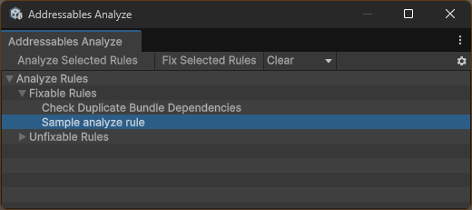

## はじめに

この記事では以下の内容を紹介します。

-   Addressables の AnalyzeTool に独自のルールを追加する方法
    {.list .checkBox}

Addressables についての基本的な説明などは省いていますので、  
必要に応じて公式ドキュメントなどもご確認ください。

[Addressables package](https://docs.unity3d.com/Packages/com.unity.addressables@2.3/manual/index.html){target=blank .external-link}

## 実行環境

-   Unity6000.0.23f1
-   Unity Addressables 2.3.7

Unity Addressables 2.x 系は **2.3.1 以上**でないと、AnalyzeTool 自体がないので注意です！
{.text-block .text-block--warning}

## AnalyzeTool について

[Analyze tool](https://docs.unity3d.com/Packages/com.unity.addressables@2.3/manual/editor/tools/AnalyzeTool.html){target=blank .external-link}とは、Addressables のビルド時のレイアウトの分析ツールです。

`Window > Asset Management > Addressables > Analyze` から開くことができます。

ビルドした際に「どのようにバンドルにまとめられるか」「複数のバンドルに同じアセットが含まれていないか」などを知ることができます。  
また、修正可能なルールについては「Fix Selected Rules」を押すことで自動で修正することが可能です。

この分析のルールに独自のルールを追加したり、修正可能なルール場合は修正する処理の定義などができます。

## AnalyzeRule について

AnalyzeTool で分析に使用されるルールです。  
分析ルールのクラスとして存在しています：[AnalyzeRule](https://docs.unity3d.com/Packages/com.unity.addressables@2.3/api/UnityEditor.AddressableAssets.Build.AnalyzeRules.AnalyzeRule.html){target=blank .external-link}

[AnalyzeRule](https://docs.unity3d.com/Packages/com.unity.addressables@2.3/api/UnityEditor.AddressableAssets.Build.AnalyzeRules.AnalyzeRule.html){target=blank .external-link}を継承したクラスで分析ルールを定義することで、  
AnalyzeTool 上で分析ルールとして分析や修正ができます。

概ね以下の流れで独自ルールの追加を行います。

1. `AnalyzeRule`を継承した独自ルールクラスを定義
2. 独自ルールクラスを`AnalyzeSystem`に登録
3. AnalyzeTool で分析や修正が可能になる

### AnalyzeRule の派生クラス

[AnalyzeRule](https://docs.unity3d.com/Packages/com.unity.addressables@2.3/api/UnityEditor.AddressableAssets.Build.AnalyzeRules.AnalyzeRule.html){target=blank .external-link}のドキュメントを見るとわかると思いますが、  
[BundleRuleBase](https://docs.unity3d.com/Packages/com.unity.addressables@2.3/api/UnityEditor.AddressableAssets.Build.AnalyzeRules.BundleRuleBase.html){target=blank .external-link}という派生クラスがあり、  
さらに`BundleRuleBase`の派生クラスに[CheckBundleDupeDependencies](https://docs.unity3d.com/Packages/com.unity.addressables@2.3/api/UnityEditor.AddressableAssets.Build.AnalyzeRules.CheckBundleDupeDependencies.html){target=blank .external-link}などがあります。

`BundleRuleBase`から派生している以下の 3 つは、既に AnalyzeTool に追加されているルールです。  
ここから派生することも可能です。今回は`CheckBundleDupeDependencies`の派生クラスとして独自ルールを追加してみています。

-   CheckBundleDupeDependencies
-   CheckResourcesDupeDependencies
-   CheckSceneDupeDependencies

## 独自ルールを作成してみる

`CheckBundleDupeDependencies`の派生クラスとして独自ルールを追加します。  
`CheckBundleDupeDependencies`は複数のバンドルに同じアセットが含まれていないか（重複チェック）、を分析、修正できるルールです。

今回は「重複チェック」をしたうえで、「特定のフォルダに含まれているものは、特定のグループに移動（もしくは登録）する」という修正機能をもたせます。

想定ケースは以下の通りです。

-   プレハブを Addressable に登録
-   プレハブの登録グループの設定は`Bundle Mode`が`PackSeparately`（→ プレハブごとに 1 つのバンドルにまとめる）
-   複数のプレハブで同じマテリアルを使用している（そのままでは複数のバンドルに同じマテリアルが含まれてします）
-   複数のプレハブで使用されているマテリアルだけ、Addressable に PackSeparately で登録する（重複していないものはそのままプレハブと同じバンドルにしておく）

以下のコードは Editor フォルダに入れる前提のため、#if UNITY_EDITOR などで囲っていません。  
{.text-block .text-block--warning}

```cs
using System.IO;
using System.Linq;
using UnityEditor;
using UnityEditor.AddressableAssets.Build;
using UnityEditor.AddressableAssets.Build.AnalyzeRules;
using UnityEditor.AddressableAssets.Settings;
using UnityEditor.AddressableAssets.Settings.GroupSchemas;

public class SampleAnalyzeRule : CheckBundleDupeDependencies
{
    /// <inheritdoc/>
    public override string ruleName => "Sample analyze rule";

    /// <inheritdoc/>
    public override bool CanFix => true;

    /// <inheritdoc/>
    public override void FixIssues(AddressableAssetSettings settings)
    {
        if (this.CheckDupeResults == null)
        {
            this.CheckForDuplicateDependencies(settings);
        }

        if (!this.CheckDupeResults.Any())
        {
            return;
        }

        var group = settings.groups
            .Where(group => group.Name == "SampleGroup")
            .FirstOrDefault();

        if (group == null)
        {
            // 指定のグループがまだ作られていなければ、作っておく　
            group = settings.CreateGroup("SampleGroup", false, false, false, null, typeof(BundledAssetGroupSchema), typeof(ContentUpdateGroupSchema));
            group.GetSchema<ContentUpdateGroupSchema>().StaticContent = true;
            group.GetSchema<BundledAssetGroupSchema>().BundleMode = BundledAssetGroupSchema.BundlePackingMode.PackSeparately;
        }

        foreach (var result in this.CheckDupeResults)
        {
            // 特定のアセットパスのものだけ、指定のグループに移動する
            if (result.AssetPath.Contains("Assets/Materials/"))
            {
                var entry = settings.CreateOrMoveEntry(result.DuplicatedGroupGuid.ToString(), group, false, false);
                entry.SetAddress(Path.GetFileNameWithoutExtension(entry.AssetPath));
            }
        }

        settings.SetDirty(AddressableAssetSettings.ModificationEvent.BatchModification, null, true, true);
    }

    /// <summary>
    /// 実行時にルールを登録するためのクラス
    /// </summary>
    [InitializeOnLoad]
    private class RegisterSampleAnalyzeRule
    {
        /// <summary>
        /// コンストラクタ
        /// </summary>
        static RegisterSampleAnalyzeRule()
        {
            AnalyzeSystem.RegisterNewRule<SampleAnalyzeRule>();
        }
    }
}

```

上記のコードを作成すると、独自ルールが AnalyzeTool に追加されます。  


他のルール同様、「Analyze Selected Rules」で分析の実行、「Fix Selected Rules」で修正の実行ができます。

今回はプレハブごとにまとまるようにしていますが、ある程度いくつかのプレハブをまとめたうえで、  
複数のバンドルで重複しているアセットを登録する際にも同じようにできるかと思います。

:::{.text-block .text-block--info}

関連：

アセットバンドルの数に比例してアセットバンドルのメタデータが変化します。バンドルの数が多すぎると、その分多くのメモリを消費します。  
これを回避するために、バンドルの数を減らしつつ、グループ分けなどだけで上手くバンドルにまとめられないものは今回のように独自の分析ルールと修正によって解決することができます。

-   [最適化の最前線から：Addressables を使ってメモリを節約する](https://unity.com/ja/blog/technology/tales-from-the-optimization-trenches-saving-memory-with-addressables){target=blank .external-link}
-   [AddressablesMemoryOptimizations/Assets/Editor
    /CheckBundleDupeDependenciesV2.cs](https://github.com/patrickdevarney/AddressablesMemoryOptimizations/blob/main/Assets/Editor/CheckBundleDupeDependenciesV2.cs){target=blank .external-link}

:::

## 参考

-   [Analyze tool](https://docs.unity3d.com/Packages/com.unity.addressables@2.3/manual/editor/tools/AnalyzeTool.html){target=blank .external-link}
-   [Analyze tool ＞ Extending Analyze](https://docs.unity3d.com/Packages/com.unity.addressables@2.3/manual/editor/tools/AnalyzeTool.html#extending-analyze){target=blank .external-link}
-   [AnalyzeRule](https://docs.unity3d.com/Packages/com.unity.addressables@2.3/api/UnityEditor.AddressableAssets.Build.AnalyzeRules.AnalyzeRule.html){target=blank .external-link}
-   [BundleRuleBase](https://docs.unity3d.com/Packages/com.unity.addressables@2.3/api/UnityEditor.AddressableAssets.Build.AnalyzeRules.BundleRuleBase.html){target=blank .external-link}
-   [CheckBundleDupeDependencies](https://docs.unity3d.com/Packages/com.unity.addressables@2.3/api/UnityEditor.AddressableAssets.Build.AnalyzeRules.CheckBundleDupeDependencies.html){target=blank .external-link}
-   [Addressables-Sample/Advanced/CustomAnalyzeRule/Assets/Samples/Addressables/1.20.0/Custom Analyze Rules/Editor/](https://github.com/Unity-Technologies/Addressables-Sample/tree/master/Advanced/CustomAnalyzeRule/Assets/Samples/Addressables/1.20.0/Custom%20Analyze%20Rules/Editor){target=blank .external-link}
-   [](){target=blank .external-link}
