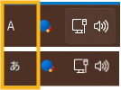
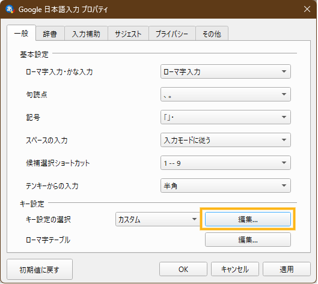
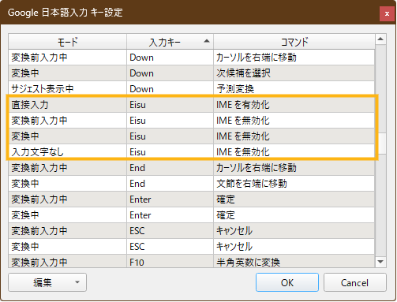
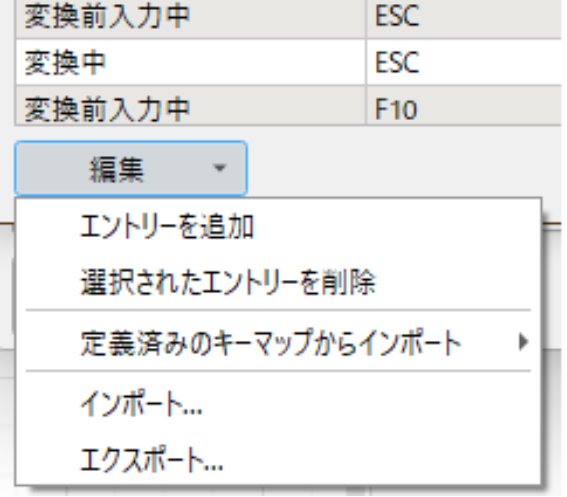

## できること

CapsLock キーで半角全角キーのように、日本語 ←→ 英数の切り替えができるようになります！  
Google 日本語入力では、CapsLock キーは `Eisu`という表記です！

## 設定の準備

1. [Google 日本語入力](https://www.google.co.jp/ime/){target=blank .external-link}をダウンロード
2. IME を Google 日本語入力に変更する

Google 日本語入力のキーマップを変えることで、実現します。  
この記事では Google 日本語入力での方法を書くので、同じようにやりたい場合は Google 日本語入力を使用してください。

キー割当を変更するだけなので、他の IME でもできるかもしれません。{.text-block .text-block}

## Google 日本語入力での設定

1. Google 日本語入力のプロパティを開く  
   タスクバーの「あ」と書いてあるところを右クリックするとメニューが開きます。  
   辞書登録などと並んで「プロパティ」というメニュー項目があるので、それをクリックします。  
   
2. 開いたプロパティウィンドウの「一般」タブを開く  
   最初に開かれているタブです。
3. 「キー設定」＞「キー設定の選択」の「編集…」をクリック  
   
4. 「Google 日本語入力キー設定」が開かれる
5. 「入力キー」`Eisu` （CapsLock キー）の設定を `Hankaku/Zenkaku` と同じにする  
   「入力キー」をクリックすると入力キーでソートされるので、`Eisu` の設定がしやすいと思います！
   |モード|コマンド|
   |--|--|
   |変換前入力中|IME を無効化|
   |変換中|IME を無効化|
   |入力文字なし|IME を無効化|
   |直接入力|IME を**有**効化|

    

6. 設定ができたら「OK」をクリック
7. Google 日本語入力プロパティウィンドウに戻るので、「OK」をクリック

以上で設定完了です！

メモかなにかで CapsLock を押してみて、日本語 ←→ 英語で切り替わるようになっていれば成功です！  
やったね！

## まとめ

Google 日本語入力のキー設定を半角全角キーを同じにすることで、CapsLock で日本語英語切り替えができるようにしました。

他にも気になるものがあれば、カスタムしてみるといいでしょう。

## おまけ

キー設定の編集ウィンドウで「編集 ▼」というボタンを押すと、キーマップのインポートやエクスポートができます。  
{width=50%}

編集後にエクスポートしておくと、別のパソコンになってもエクスポートして保存しておいたキーマップをインポートするだけで、  
元通りになります。

プロパティウィンドウでは、他にも辞書のインポートやエクスポートもできます。

活用してよき入力ライフを！
